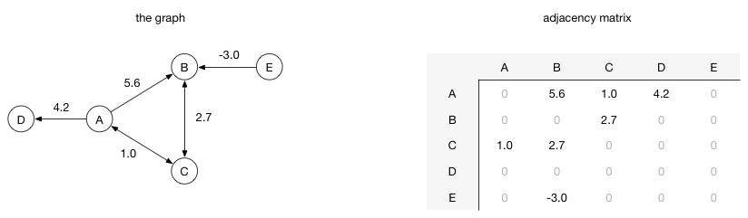

# 图 Graph

图（Graph）是表示物件与物件之间的关系的数学对象，是图论的基本研究对象。一个不带权图中若两点不相邻，邻接矩阵相应位置为0，对带权图(网)，相应位置为∞。
对于一个拥有n个顶点的无向连通图，它的边数一定多于n-1条。若从中选择n-1条边，使得无向图仍然连通，则由n个顶点及这 n-1条边（弧）组成的图被称为原无向图的生成树

## 为什么要使用图？
也许你耸耸肩然后心里想着，有什么大不了的。好吧，事实证明图是一种有用的数据结构。

如果你有一个编程问题可以通过顶点和边表示出来，那么你就可以将你的问题用图画出来，然后使用著名的图算法（比如广度优先搜索 或者 深度优先搜索）来找到解决方案。

例如，假设你有一系列任务需要完成，但是有的任务必须等待其他任务完成后才可以开始。你可以通过非循环有向图来建立模型：

每一个顶点代表一个任务。两个任务之间的边表示目的任务必须等到源任务完成后才可以开始。比如，在任务B和任务D都完成之前，任务C不可以开始。在任务A完成之前，任务A和D都不能开始。

现在这个问题就通过图描述清楚了，你可以使用深度优先搜索算法来执行执行拓扑排序。这样就可以将所有的任务排入最优的执行顺序，保证等待任务完成的时间最小化。（这里可能的顺序之一是：A, B, D, E, C, F, G, H, I, J, K）

不管是什么时候遇到困难的编程问题，问一问自己：“如何用图来表述这个问题？”。图都是用于表示数据之间的关系。 诀窍在于如何定义“关系”。

如果你是一个音乐家你可能会喜欢这个图：

这些顶点来自C大调的和弦。这些边--表示和弦之间的关系--描述了怎样从一个和弦到另一个和弦。这是一个有向图，所以箭头的方向表示了怎样从一个和弦到下一个和弦。它同时还是一个加权图，每一条边的权重（这里用线条的宽度来表示）说明了两个和弦之间的强弱关系。如你所见，G7-和弦后是一个C和弦和一个很轻的 Am 和弦。

程序员常用的另一个图就是状态机，这里的边描述了状态之间切换的条件。下面这个状态机描述了一个猫的状态：

图真的很棒。Facebook 就从他们的社交图中赚取了巨额财富。如果计划学习任何数据结构，则应该选择图，以及大量的标准图算法。

顶点和边
理论上，图就是一堆顶点和边对象而已，但是怎么在代码中来描述呢？

有两种主要的方法：邻接链表和邻接矩阵。

邻接链表：在邻接链表实现中，每一个顶点会存储一个从它这里开始的边的列表。比如，如果顶点A 有一条边到B、C和D，那么A的列表中会有3条边

邻接链表只描述了指向外部的边。A 有一条边到B，但是B没有边到A，所以 A没有出现在B的邻接链表中。查找两个顶点之间的边或者权重会比较费时，因为遍历邻接链表直到找到为止。

邻接矩阵：在邻接矩阵实现中，由行和列都表示顶点，由两个顶点所决定的矩阵对应元素表示这里两个顶点是否相连、如果相连这个值表示的是相连边的权重。例如，如果从顶点A到顶点B有一条权重为 5.6 的边，那么矩阵中第A行第B列的位置的元素值应该是5.6：

往这个图中添加顶点的成本非常昂贵，因为新的矩阵结果必须重新按照新的行/列创建，然后将已有的数据复制到新的矩阵中。

所以使用哪一个呢？大多数时候，选择邻接链表是正确的。下面是两种实现方法更详细的比较。

假设 V 表示图中顶点的个数，E 表示边的个数。

操作|	邻接链表|	邻接矩阵
---|---|---
存储空间	|O(V + E)	|O(V^2)
添加顶点  |	O(1)    |	O(V^2)
添加边    |O(1)	    |O(1)
检查相邻性|	O(V)    |	O(1)

“检查相邻性” 是指对于给定的顶点，尝试确定它是否是另一个顶点的邻居。在邻接链表中检查相邻性的时间复杂度是O(V)，因为最坏的情况是一个顶点与每一个顶点都相连。

在 稀疏图的情况下，每一个顶点都只会和少数几个顶点相连，这种情况下相邻列表是最佳选择。如果这个图比较密集，每一个顶点都和大多数其他顶点相连，那么相邻矩阵更合适。

